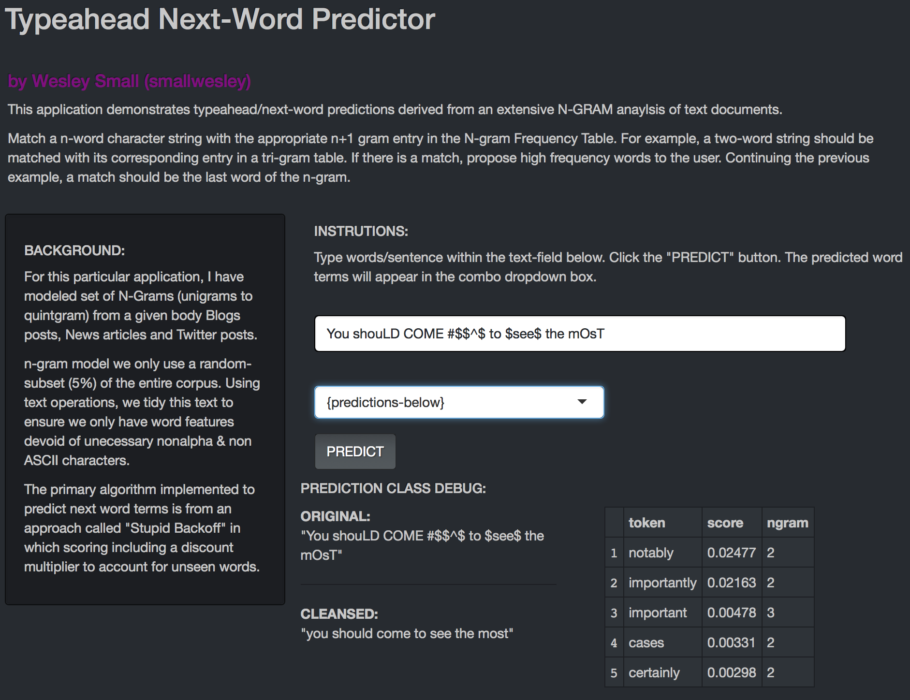

Next Word Predictor
========================================================
author: Wesley Small
date: December 2016 
autosize: true
class: small-code

Synopsis: The predictor application provides one (or more) predicted next-words based that could potentially succeed the phrase entered This tool mimics basic succeeding predictability as found in search tools products (i.e. Google search bar). The usage of n-grams database of english text, with a backoff scoring technique, provides the means to suggest words and account for unseen terms.

**Access Tool**: "<https://smallwesley.shinyapps.io/shiny_predictor/>"

Application WorkFlow
========================================================

The predictor tool utilizes a database n-grams that are generated from "SwiftKey" Corpora. A clean step filter the a training sample to the tidy of contiguous word-only segments (sentences).
Utilizing text mining machine learning algorithms ([Quanteda](https://cran.r-project.org/web/packages/quanteda/quanteda.pdf) package), it is possibly to produce document term matrixes containing n-grams. These are filtered until we have a clean set of term frequencies to utilize in prediction.

Predictor Algorithm
========================================================

A custom-built “Stupid Backoff” algorithm has been implement to score/rank next word suggestions.  The n-gram database is queried, matching the end of the inputed phrase. When there is no match from a high-order n-gram (i.e. quintgrams) “backs off” to lower-order n-grams until a highest score match is found. Each time a backoff is required, the score is reduced using a fixed discount multipler (0.4). Answer: Top scored terms.

Stupid BackOff Algorithm, Section 4 @ [aclweb](http://www.aclweb.org/anthology/D07-1090.pdf) states: *"Stupid Backoff is inexpensive to calculate, ...,  while approaching the quality of Kneser-Ney smoothing for large amounts of data."*

Predictor Tool & Guidelines
========================================================
left: 40%

***
You can access the Typeahead Next Word Predictor [here](https://smallwesley.shinyapps.io/shiny_predictor/).

- The longer input field allows your to type or cut/paste a phrase. Press 'PREDICT' button to execute. 
- The 2nd combobox, when populated, will contain a list of next word suggestion. Initially it will be empty.
- The debug section displays more details about the prediction score & ngram level.

Performance & Constraints
========================================================

Speed:  In order to ensure fast lookups and portability for this predictor, a small dataset was extracted from the original documents to help train and test our predictive model. Testing included generating & conducting predictions with subset sizes from 1% to 50% of the entire corpus documents. 

Sacrifice:  To future reduce the load on the system, terms that appeared a few times in only a few documents were dropped once we had a Document Terms Matrix for each n-gram level. Shiny applications are contrained to 100MBs we we ensured that the entire tool libraries plus data files could be pushed to shinyapps.io. 

Code repo for this project: 
[smallwesley@github](https://github.com/smallwesley/coursera-ds-capstone/tree/master/shiny_predictor)

Summary & Acknowledgements
========================================================

During this project, a variety of online resources were research to gain an overall understanding aobut Natural language process AND various smoothing operations related utilizing n-grams used in prediction. Here are a few of link that fit on this slide:

- [Katz's Back-off Model](https://en.wikipedia.org/wiki/Katz's_back-off_model)
- [Smoothing & Backoff, Presentation From Cornell ](https://www.cs.cornell.edu/courses/CS4740/2012sp/lectures/smoothing+backoff-1-4pp.pdf)
- [WhatsNext: Prediction System Article](http://www9.org/w9-papers/Performance/142.pdf)
- [Language Models in ML](http://www.aclweb.org/anthology/D07-1090.pdf)
- [Stupid Back-off Model](https://lagunita.stanford.edu/c4x/Engineering/CS-224N/asset/slp4.pdf)
- [Good-Turing Discounting Video on Quora](https://www.quora.com/What-is-good-way-to-understand-good-turing-Discounting)
- [PDF on Machine Learning for Language Modelling](http://www.marekrei.com/pub/Machine_Learning_for_Language_Modelling_-_lecture2.pdf)
- [Where to start with Text Mining](https://tedunderwood.com/2012/08/14/where-to-start-with-text-mining/)
